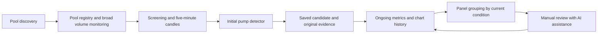

# Current implementation direction — 27 September 2026

The consolidation-first workflow in README.md supersedes the older discovery-first screen layout below. Discover rises quietly; surface sustained active bases for review. Preserve all risk, supply, liquidity, linked-pool, range and human-feedback evidence. The revised interface uses Shortlist, Following, Updates and Archive, with feedback behind a button and technical research secondary.

Price rises can span hours and volume is relative to the coin itself. Hours-long bases remain eligible; persistence increases ranking weight. Swarm is one shape example with unknown outcome. MG is a shorter-duration comparison, not ground truth derived from its later price. Visual suspicions about ownership are human notes, not measured concentration.

Sideways and gently rising bases are assessed separately. A qualified rising base receives extra review priority, with an additional increase for measured tightening. Tier 1–5 describes band width; compression compares equal-duration halves of one assessment window. These initial cutoffs describe chart structure, not holder behaviour, future returns or calibrated confidence. OP's September 22–24 hourly formation is a reference for gradual upward consolidation, without using the subsequent breakout to justify an earlier match.

Base measurements are persisted as versioned JSON. Full normalized shape profiles and similarity search remain proposed extensions. See README.md for implemented criteria and limitations.

---

**Solana pump scanner and persistent review watchlist — implementation plan**

> Current September 27 user amendments: [CURRENT_SCOPE.md](CURRENT_SCOPE.md). Active chart scope is PumpSwap/Raydium; Meteora DLMM is a linked discovery/context signal. New mandatory supply and liquidity gates apply. This amendment takes precedence over older scope/eligibility descriptions below; original requirements remain as history.

Updated 27 September 2026. Budget ceiling: $25/month. Start with a local pilot; target roughly $7–$15/month for hosting and backup if free data allowances cover the measured workload. Status: a first local version is implemented with live API collection and a candle detector; it is not deployed to paid hosting. See the [first-version guide](/Users/bv/Documents/SCAN_INFRA/README.md) for working features and the explicit coverage gaps. This document retains the full intended scope; the pilot has not yet passed every completion gate below.

This is the controlling plan for product behavior and implementation order. The [detector specification](/Users/bv/Documents/SCAN_INFRA/PATTERN_SCANNER_SPEC.md) contains detailed feature definitions and calibration settings. [Research notes](/Users/bv/Documents/SCAN_INFRA/research/INFRA_RESEARCH.md) preserve source comparisons and earlier probes; historical proposals in those notes do not override this plan.

The [requirements audit](/Users/bv/Documents/SCAN_INFRA/REQUIREMENTS_AUDIT.md) traces the original request and later clarifications into this plan. Pattern detection adds to the original pool-discovery and volume scanner; it does not replace it. Proposed thresholds, screening horizons, capacity examples and refresh schedules remain implementation hypotheses, not user-approved limits on coverage.

**What we are building**

A scanner that discovers newly graduated PumpSwap/Raydium pools and newly seeded Meteora pools, monitors their volume, and identifies substantial early pumps with elevated activity. Save qualifying coins and provide a persistent chart panel for manual review with AI assistance. It targets the initial formation in [Image 2](</Users/bv/Downloads/Print (1).png>); later review looks for a base resembling [Image 1](/Users/bv/Downloads/Print.png).

The essential distinction is between **historical qualification** and **current condition**. A coin qualified because an initial pump and volume event occurred. Its current price, current volume, and latest formation can change without erasing that evidence or removing it from the watchlist.

| Requirement | Agreed behavior |
|---|---|
| Venues | PumpSwap graduations, Raydium graduations, and new seeded Meteora pools; identify DBC migrations separately |
| Broad scanning | Discover and monitor new-pool volume before selecting pattern candidates; preserve nonmatches and screening reasons |
| Cost and speed | $0–$25/month; target roughly one-minute discovery and recent-pool metric updates, subject to measured source lag and coverage |
| Automatic detection | Find the initial pump; an early developing-pump flag can precede the fuller pump/pullback match |
| Later consolidation | Assessed manually with AI assistance; a possible base can develop over days, weeks, or longer |
| Preferred range | $30k–$250k market cap during consolidation, used for ranking rather than exclusion |
| Initial peak | May exceed $250k |
| Below $30k | Keep the previously qualifying coin in “Dropping below $30k” |
| Retention | No age-based expiry; remain tracked until the user archives the candidate |
| Recovery | At $30k or above, return to the appropriate main grouping and preserve the prior below-$30k history |
| Human control | Pin, review, annotate, prioritize, archive, and restore; no automatic trading |

**The collection and detection pipeline**

1. **Discover the destination pool.** Record the successful creation/migration transaction, mint, pool, venue, origin evidence, activation state, and observation time. Do not equate bonding-curve completion with completed migration.
2. **Monitor broad activity, then screen cheaply.** Collect price, liquidity and volume snapshots for newly discovered pools, including pools that have not matched a pattern. Record pool age, activation, measurement window, source, freshness and coverage. Use these metrics to prioritize candle retrieval. Preserve discovered identifiers, available metrics and screening reasons so exclusions remain inspectable. Inspect a small control sample that did not pass screening to estimate missed formations.
3. **Retrieve actual candles.** Obtain five-minute OHLCV, with enough history to evaluate the early move. Build UTC-aligned 15-minute review candles. Price snapshots and rolling-volume differences are not substitutes for OHLCV.
4. **Detect and save the initial episode.** Evaluate multi-candle price expansion, relative volume, continuity of trading, peak/pullback structure, and data quality. Save the feature values, evidence window, detector version, and time the condition became observable.
5. **Create a persistent candidate.** One watchlist row per token mint, linked to its pool history and qualifying episodes. Repeated observations update the row; genuinely new pump episodes can be attached without duplicating the coin.
6. **Refresh, group and review.** Update current metrics, evaluate the $30k boundary, and refresh the chart. Review decisions and AI notes attach to the candidate and retain their as-of timestamps.

The cheap screen is a cost/coverage tradeoff. If it rejects a pool whose history later contains the desired formation, that is a measured miss, not proof the formation was absent. Show unknown or delayed data explicitly.

**How the initial detector starts**

Use deterministic, configurable rules first. Candidate settings include a roughly 2× closing-price rise across 15–180 minutes, several active candles, and a material volume expansion. Where a reliable earlier baseline exists, test around 3× comparable-window volume; for new launches, compare with similarly aged launches instead. These numbers are hypotheses to calibrate, not approved strategy parameters or proven predictive thresholds.

An elevated-volume rising leg can create a provisional candidate. A subsequent pullback provides the closer match to Image 2. Do not require the future base or breakout before recording the initial opportunity to review. Preserve the initial qualification even if the later pullback removes most of the gain.

Use closing-price structure and supporting trade activity to avoid classifying a single isolated wick as the entire pump. Keep high and close separately. Do not infer large relative volume from an empty baseline; insufficient history is a data-status flag.

The initial 24-hour launch-screening window and tested pullback durations are tunable workload settings, not user-requested eligibility cutoffs. Continue screening beyond the original first-hour proposal; measure missed later pumps before choosing any active screening horizon and preserve registry records when lowering their polling priority. No proposed time window limits how long an already detected candidate can consolidate. Pattern review must use only candles available at the time; later rallies must be hidden when evaluating early alerts.

**The panel**

| Section | Contents | Main action |
|---|---|---|
| New pumps | Newly flagged, unreviewed candidates, including clearly labeled provisional matches | Inspect the original pump and decide whether to prioritize it |
| Watching for a base | Previously reviewed candidates being followed for consolidation | Review the evolving range and record an assessment |
| Dropping below $30k | Qualifying candidates whose latest valid market cap is below $30k | Continue review with original pump/volume evidence visible |
| Archived | Candidates explicitly archived by the user | Inspect history or restore |

“Pinned,” venue, market-cap band, formation stage, review due, and data quality are filters/badges across sections. Pinning increases priority without bypassing the below-$30k grouping. A new candidate below $30k appears in that section with an **unreviewed** badge, so it is not lost from the review queue. Above $250k remains eligible and is labeled outside the preferred band.

Keep the underlying scanned-pool registry accessible through a simple read-only view, including pools with no pump match, their volume windows, last update and screening reasons. The candidate board is a selected subset of this broader scanner, not the only evidence that scanning occurred. This view is an implementation proposal to make the original scanning requirement inspectable.

Each row shows token/mint, venue, current market cap and basis, original pump peak and volume, current activity/liquidity, candidate age, review status, and last successful update. The detail view includes original and subsequent candles, volume, alert markers, below-$30k observations/recoveries, source gaps, and review notes. Provide five-minute/15-minute detail and hourly/four-hour views for longer bases.

**Exact behavior below $30k**

- Evaluate the boundary only for an already flagged pump/volume candidate. This is not a feed of every low-cap coin.
- A fresh, valid market-cap observation **below $30,000** moves it to the below-$30k section. Save the observed time and value; do not imply that the precise on-chain crossing time is known.
- Leave its historical qualification, formation stage, review status and notes intact. There is no new lower cutoff and no automatic archive.
- At **$30,000 or above**, a fresh valid observation returns it to New pumps or Watching for a base according to its review status. Keep all earlier below-threshold episodes.
- An already-under-$30k candidate is labeled “first observed below,” rather than receiving a fabricated crossing from above.
- Missing, stale or invalid values do not count as zero and do not produce transitions. Retain the last valid grouping with a visible data warning; if no usable value has ever existed, leave the candidate in its normal review section with market cap unknown.
- Repeated polls showing the same state update the observation rather than producing repeated entry events. Section changes do not themselves generate external messages.

Use an explicit market-cap basis per token, with source and timestamps. Prefer substantiated circulating-supply market cap. If only price × total supply is available, display it as an FDV estimate rather than silently calling it market cap. Do not force an exact market-cap classification from an unsupported supply figure. During the pilot, quantify how often this limits classification; retain those coins for review instead of excluding them. Supply corrections or source changes must be identified separately from price-driven crossings.

**Following candidates for weeks**

Pattern stage, panel grouping, review status, and polling priority are independent. A quiet below-$30k coin can still be forming a possible base. A falling price does not erase its history, and an old candidate does not need to be re-detected to remain visible.

| Work / monitoring priority | Proposed initial refresh setting | Effect |
|---|---|---|
| New-pool discovery | Filtered events, with fallback/reconciliation polls around 30 seconds | Target discovery within roughly one minute; measure by route |
| Broad recent-pool volume and price | Every 30–60 seconds, batched where supported | Preserve the original fast screening layer; show each provider's actual volume window and source age |
| New/active initial formation | Five-minute candles every five minutes | Evaluate closed candles; faster snapshot heads-ups remain provisional |
| Prioritized or changing base | Every 15 minutes | Retrieve all intervening candles |
| Quiet retained candidate | Every one to six hours, according to capacity | Preserve history with a visibly slower review/update cadence |
| User requests review | Refresh through the shared request queue | If refresh fails or is delayed, disclose the as-of time |

Activity observed in a background check promotes a candidate again. A six-hour refresh can take up to that interval, plus source lag, to notice a change; it is not a real-time alert tier. Track next scheduled check and backlog age. If the watchlist outgrows capacity, slow or queue work visibly instead of silently deleting candidates.

The slower candidate tiers are proposed cost tradeoffs, not a change to the approximately one-minute goal for discovery and recent-pool metrics. They also delay detecting a $30k crossing on an older coin. Measure metadata/price refresh separately from candle retrieval: inexpensive batched metrics may remain faster even when chart requests are less frequent. Include both workloads in the budget; the candle-only capacity example below does not account for the whole scanner. A fast polling interval cannot eliminate upstream indexing delay.

Keep the original five-minute pump window, recent detailed candles, and 15-minute history covering the entire unarchived lifetime. Retain compressed exports if needed for storage. Never truncate an unfinished base at a blanket 30-day boundary. A user can archive and later restore a record; show any resulting observation gap.

**Data sources and the remaining verification work**

| Layer | First choice to test | Fallback / outstanding issue |
|---|---|---|
| Narrow launch/migration discovery | Helius Parsed Streams with creation/migration instruction filters | Verify each program and instruction against the live catalog before relying on coverage |
| Pump graduations | Filtered migration evidence | PumpPortal's free migration subscription; previous test established acknowledgement only |
| Raydium graduations | Filtered migration and destination-pool events | LaunchLab migration-wallet polling was demonstrated; other launchpads need separate coverage verification |
| Meteora launches | DAMM v2/DLMM creation events and native newest-pool lists | Include DAMM v1/DBC paths in the coverage matrix; list freshness is not proof of complete coverage |
| Inexpensive screening | DEX Screener and native protocol metrics | Exact destination-pool selection; curves and graduated pools remain separate |
| Candidate candles | GeckoTerminal public OHLCV; native Meteora OHLCV where validated | Confirm coverage, units, lag, pagination and retention for actual target pools |
| Exact swap-derived candles | Restricted transaction subscriptions | Optional when needed and affordable; do not assume unlimited free trade ingestion |

Required coverage must remain explicit by route:

- **PumpSwap:** verify successful Pump graduation into its destination pool. A generic PumpSwap pool creation is not enough to label a graduation; keep bonding-curve trading separate.
- **Raydium:** cover graduation into CPMM and applicable legacy AMM v4 pools. LaunchLab is the first verified route, not the whole Raydium requirement. Enumerate other origin routes and unsupported decoders in the coverage matrix. CLMM remains a possible expansion rather than an implicit prerequisite.
- **Meteora:** retain directly seeded DAMM v2 and DLMM launches, the DAMM v1 coverage adapter, and DBC-to-DAMM migrations as distinct paths. Verify creation, actual funding and trading activation separately. A new pool for an existing token is not automatically a new token launch.
- Store insufficient provenance as **origin unknown**, keep the record available, and measure the gap. Do not infer origin from names, mint suffixes or a provider's DEX label. Do not claim full venue coverage while required paths remain unverified.

Carry forward the original fallbacks and recovery design: PumpPortal's free migration subscription (not its paid trade feed); current LaunchLab migration-signer polling with configuration refresh, saved cursors and unseen successful transactions only; Meteora newest-pool pagination with overlap for late-indexed records; and secondary reconciliation through indexed APIs. DAMM v1 needs a validated creation-event path because its search endpoint is not a reliable newest-pool cursor. Keep the optional free RPC fallback from the research notes as a candidate to validate. A provider's general newest-pools page is not proof of complete discovery.

Persist checkpoints, reconnect with backoff, recover overlapping intervals and deduplicate. Bound outage backfills by quota and show unresolved gaps. An API key, decoder catalog coverage and live migration payloads still need verification. Do not substitute a broad, metered program-log or trade feed and assume that filtering it after receipt preserves the free budget. Implementation details, billing distinctions and source links are retained in the [discovery and volume research](/Users/bv/Documents/SCAN_INFRA/research/INFRA_RESEARCH.md).

Helius documents instruction-filtered Parsed Streams on Free at one credit per matching notification. This is the first low-cost discovery experiment, not an already working dependency. [Helius documentation](https://www.helius.dev/docs/parsed-streams)

GeckoTerminal documents free candle access and a 30-call/minute public limit. DEX Screener documents pair metrics; it does not provide the needed public candle endpoint in the reference reviewed. Meteora documents native candles. [GeckoTerminal](https://apiguide.geckoterminal.com/faq), [DEX Screener](https://docs.dexscreener.com/api/reference), [Meteora candles](https://docs.meteora.ag/api-reference/damm-v2/pools/ohlcv)

Previous probes demonstrated fresh DAMM v2 pool records, a Raydium migration transaction, pair metrics and one GeckoTerminal candle response. They did **not** establish complete candle coverage across PumpSwap/Raydium/Meteora. The native Meteora candle request returned an error. Resolve these gaps before making the dashboard dependent on those feeds. [Candle probe evidence](/Users/bv/Documents/SCAN_INFRA/research/ohlcv-probes.json)

Pool identity and token identity remain separate. Do not concatenate different pools' OHLCV or add aggregator summaries to their underlying pool swaps. Verify quote orientation, decimals, USD conversion, Token-2022 handling, and volume units. Missing candles must not manufacture a flat accumulation range. Keep source event time and arrival time to distinguish real-time observations from later backfills.

Preserve the two original volume modes. **Indexed volume** carries its actual reported window and source freshness; cumulative differences are observation-interval estimates, and differences between rolling five-minute values are not one-minute volume. **Selected swap-derived volume** counts the executed quote amount once per pool swap, excluding migration funding, liquidity deposits/withdrawals, failed transactions, unrelated transfers and fees counted as separate trades. Deduplicate by transaction signature plus instruction/inner-instruction location and pool; one routed transaction can contain several legitimate swaps. Preserve exact token amounts/decimals and the quote-to-USD conversion source and time. Never mix pre-migration curve volume into post-graduation pool volume. Pool-level volume and token-level turnover must remain distinguishable.

Backfill from activation/migration where reliable history and quota permit. Otherwise show **observed since** and partial coverage, including at cold start or after an outage. Do not present an incomplete first window as zero activity or a full launch history. Retain the optional exact-swap adapter for validation and selected cases; broad exact ingestion is not a prerequisite for the budget MVP.

**AI assistance**

For MVP, AI review is requested by the user. Prepare an as-of chart and numerical evidence bundle with the original trigger, price/volume history, range metrics, market-cap basis, liquidity changes, missing data, and previous review notes.

The review should explain supporting evidence, conflicting evidence, changes since last review, and observations to revisit. The user labels the candidate as worth watching, a possible base, not matching, or insufficient data. These labels do not automatically archive a coin or place trades. Candle resemblance alone must not be presented as proven accumulation or a calibrated probability of a breakout.

Start by exporting the review bundle for use in the existing assistant workflow. A paid model API is optional later, with a separate cap inside the overall budget; it is not required to run the first-stage scanner.

**Infrastructure and cost controls**

One TypeScript/Node.js service, one SQLite database, and a browser panel served by the same application are sufficient for the first implementation. Run a single durable request scheduler with per-provider limits, cursor recovery, retries, deduplication and usage counters. Persist data before marking work complete. Use a process supervisor and a tested database backup/restore procedure; expose the initial panel locally or through private access.

| Expense | Starting assumption |
|---|---:|
| Local pilot | $0 additional subscriptions; existing electricity/internet excluded |
| Small hosted machine | $6–$12/month |
| Weekly provider backup | $1.20–$2.40/month |
| Data subscriptions | $0 while actual usage fits verified free allowances |
| Automated AI API | Off for MVP |
| Base hosted target | **$7.20–$14.40 before tax** |

The server and weekly-backup figures follow current DigitalOcean pricing. Keep total billed costs, including tax and any later storage/AI/data additions, within $25. [Server pricing](https://www.digitalocean.com/pricing/droplets)

As a capacity example, 60 formation candidates checked every five minutes, 60 bases every 15 minutes and 120 quiet candidates hourly consume 18 single-page candle requests/minute. Reserve two more for backfill/retries and keep the remainder of a 30/minute limit for other work and headroom. Multi-page responses consume more; enforce the actual shared allowance rather than treating this as a promise of 240 fully covered coins.

For Helius, reserve room for discovery, metadata, timestamps and recovery before optional swap streams. Use measured projected credits and an application ceiling below the plan limit; leave paid autoscaling off. As usage rises, reduce optional exact tracking before discovery. Record gaps and never label sampled trade volume complete. Preserve watchlist records when work is delayed. The prior 520,000-credit example is hypothetical, not a forecast of this strategy's traffic.

**Build order and completion checks**

| Phase | Deliverable | Ready when |
|---|---|---|
| 1. Source feasibility | Route-by-route discovery, broad volume and candle coverage matrix; explicit market-cap basis | PumpSwap, Raydium and Meteora paths are each tested; real target pools can be retrieved/decoded, units validated, lag measured and unsupported paths identified |
| 2. Collector and replay data | Persistent pool registry, broad volume snapshots, candles, source timestamps, cursor recovery and request budget | Duplicate delivery, restarts, failed migrations and gaps behave correctly; sampled indexed volume is reconciled against transactions; a 48-hour infrastructure run measures the combined workload and cost |
| 3. Initial detector | Configurable, versioned pump/volume rules and saved evidence | Chronological replay finds labeled examples without future information; noisy lookalikes and misses are recorded |
| 4. Functional panel | New pumps, Watching for a base, Dropping below $30k, Archived, plus filters and charts | Grouping, review, pinning, archive/restore, freshness and long-history views match the agreed behavior |
| 5. Review workflow | User-requested evidence export / AI assistance and saved human labels | Every review is reproducible as of its timestamp and changes no eligibility or trading state without the intended user action |
| 6. Calibration and hosting | Longer-running observed cohort and small hosted deployment | Coverage, request limits, review burden, retention and backup restore meet the agreed requirements within budget |

Before the UI polish, verify these specific behaviors: a qualified coin falling to $29k stays tracked; a subsequent $31k observation restores its appropriate main grouping; exactly $30k is outside the below section; stale/null prices cause no crossing; an already-below candidate is labeled correctly; a pinned below-$30k coin stays in that section; a weeks-old quiet candidate keeps its history; repeated pumps create one coin row with multiple episodes; and archived records remain retrievable.

Evaluate launch discovery, first usable volume snapshot, first usable candle arrival and pattern alert time separately, for each venue/route. Approximately one minute remains the discovery/recent-metric target, not a guarantee for a formation that requires several completed candles. Proposed discovery acceptance is at least 95% within 60 seconds against the measured reference set, with its denominator and sampling limits stated; this is a benchmark proposal, not an agreed permission to miss the remaining launches. Report reference launches with no usable volume as missing rather than dropping them from the latency sample. Detector quality is agreement with the user's labels, alert volume, review burden and missed examples; establish acceptable thresholds after the first labeled cohort rather than inventing a profitable win rate.

The two supplied images describe one chart. Start calibration with multiple independent examples and counterexamples, then evaluate on later unseen coins. Review initial results after one to two weeks, continuing longer for bases that take weeks. A pilot review date never expires candidates. Source coverage, candle quality and sustainable ongoing requests are the first uncertainties to resolve; those determine what can be delivered reliably within $25.

## Later user additions — controls, logging and learning (2026-09-27)

These additions preserve initial pump-plus-volume detection, all three target venues, soft consolidation cap preference, no age expiry, and below-$30k evidence retention. A failed mandatory control/trading check now overrides **active eligibility**, not the retention of original chart evidence.

- Mandatory on-chain issuer mint/freeze revocation and no unapproved control extensions. User clarification explicitly allows standard Token-2022 shared-program upgradeability as a notice, plus transfer-fee configurations and metadata changes. Fee schedules and retained fee authorities are disclosed. Missing verification stays pending.
- Separate read-only buy/sell quote and liquidity/impact screen. Passing is not a trading-safety guarantee; concentration, lock/withdrawal rights and wallet-specific execution remain unchecked.
- Persistent event history with timestamps, evidence, exclusions, gaps and manual actions; UI filters and history export. No synthetic history before logging was enabled, no secret/API-key capture, no automatic history deletion.
- Structured per-chart feedback and immutable-as-recorded review snapshots, including charts the detector missed. New reviews retain old labels; summary counts deduplicate the same pool/episode. Feedback dataset is exportable for later chronological calibration and unseen-chart evaluation. No automatic threshold changes or safety-policy relaxation.

The current implementation and its tested boundaries are documented in README.md. Full ingestion coverage, validated predictive quality, autonomous model training and guaranteed tradability are not claimed.

- Further explicit user correction: MG was manually reviewed by the user and should remain tracked. An auditable per-mint manual trading-screen inclusion can override quote/liquidity warnings while preserving their displayed evidence. It never bypasses current mandatory mint/freeze/extension checks, and it does not supply a positive formation label. Approval remains dated and can be removed in the UI. Global defaults are not silently lowered for other coins.
