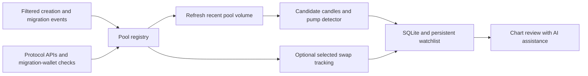

**Low-cost Solana launch and graduation scanner**

Historical research snapshot preserved on 27 September 2026. Source facts and probe results remain useful; product decisions, architecture and build order are superseded by the [current implementation plan](/Users/bv/Documents/SCAN_INFRA/SCANNER_PLAN.md).

Research date: 27 September 2026. Budget: $0–$25/month. Desired detection delay: approximately one minute. This is a researched design, not a deployed service. Prices below exclude taxes unless stated.

The user has now specified the target formation: automatically detect the initial pump/pullback, then retain candidates for manual assessment of the later consolidation with AI assistance. The preferred $30k–$250k market-cap range applies to that later consolidation; the pump can peak higher and the later range can fall below $30k. Previously qualifying candidates below $30k remain tracked in a dedicated **“Dropping below $30k”** panel section, with their original pump/volume evidence preserved. The [pattern specification](/Users/bv/Documents/SCAN_INFRA/PATTERN_SCANNER_SPEC.md) defines the updated behavior, candle requirements and validation. It supersedes the original first-hour-only monitoring proposal.

**Recommendation**

Start locally for $0, then run one small server for approximately $7–$15/month including a backup. Use narrowly filtered creation/migration notifications for discovery, free pool APIs for broad volume monitoring, and transaction-level tracking only for selected pools. Validate coverage and latency before spending on data subscriptions.

For the pattern scanner, promote screened pools to real five-minute OHLCV history and show 15-minute review charts. Watch for the initial formation through the first 24 hours as an initial calibration setting. Retain flagged candidates until the user archives them: consolidation can develop over days, weeks or longer, with no age-based expiry. Quiet candidates receive less frequent updates, with cadence shown explicitly. Candle retrieval and optional automated AI calls add workload that must be measured within the budget.

The first provider to test is **Helius Parsed Streams on its Free plan**. Its current documentation says it filters by program and instruction before delivery, supports Free accounts, and charges one credit per delivered event. This is different from its byte-metered standard WebSocket service. An API key and a coverage test are still required; this research did not exercise an authenticated Helius connection. [Parsed Streams](https://www.helius.dev/docs/parsed-streams)

The design has fallbacks: PumpPortal migrations, polling Raydium migration wallets, and Meteora's own pool APIs. These reduce dependence on any single decoder or indexer. None establishes a guarantee that every launch will be found within 60 seconds.

**What counts as a launch**

| Target | Required evidence | Coverage decision |
|---|---|---|
| Pump.fun → PumpSwap | Successful Pump migration and the resulting PumpSwap pool | Core |
| Bonding curve → Raydium | Successful migration into CPMM or a legacy AMM pool; retain originating launchpad | Core; LaunchLab is the first verified route |
| Meteora directly seeded launch | New pool, real liquidity, and its trading activation state | Core: DAMM v2 and DLMM; include DAMM v1 adapter for broader coverage |
| Meteora DBC graduation | Completed migration into DAMM, linked to the source DBC pool | Core classification when present |
| New pool for an existing token | Pool creation without evidence of a new token launch | Record separately |

Pump's own documentation identifies PumpSwap as the graduation destination. Do not build around an old assumption that contemporary Pump graduations go to Raydium. A noncanonical PumpSwap pool is not automatically a graduation. [Pump program](https://github.com/pump-fun/pump-public-docs/blob/main/docs/PUMP_PROGRAM_README.md), [PumpSwap program](https://github.com/pump-fun/pump-public-docs/blob/main/docs/PUMP_SWAP_README.md)

Raydium documentation describes CPMM as the destination for new LaunchLab launches and retains a legacy AMM migration path. One changelog carries a predeployment caveat, so implementation must verify deployed behavior and current interfaces. The live probe below did confirm a successful `MigrateToCpswap`. [LaunchLab migration changes](https://docs.raydium.io/reference/changelog/2026-08-17-launchlab-cpmm-only-platform-config)

Meteora DBC curve completion and migration are distinct events. A completed curve can still be waiting for migration. The scanner must not begin post-graduation volume at curve completion. [DBC events](https://docs.meteora.ag/developer-guides/dbc/program/events)

**Discovery design**

1. Maintain a versioned registry of official program addresses and creation/migration instructions. Cover Pump, PumpSwap, Raydium LaunchLab/CPMM/AMM v4, Meteora DAMM v2/DLMM/DAMM v1/DBC as needed. CLMM creation is an optional Raydium expansion, rather than a prerequisite for LaunchLab graduations.
2. Validate each program against Helius's decoder catalog before enabling filters. Subscribe only to the relevant creation or migration operations, with inner instructions enabled and failed transactions excluded. Keep full transaction context to identify the resulting pool and origin.
3. Decode each resulting pool, quote mint, base mint, and activation point. Record successful migration, pool creation, funding, activation, first observed swap, and first scanner observation as separate facts.
4. Confirm pool ownership and relevant instructions before assigning a graduation label. Store `origin_unknown` when evidence is insufficient. A token name, suffix, or API DEX label is not provenance.
5. Write every discovered candidate to storage before applying alert thresholds. This makes exclusions reviewable.

Helius instruction filters depend on names its catalog recognizes. Unknown instructions can therefore create blind spots. The quickstart documents one notification per matching transaction per subscription, so overlapping subscriptions can consume multiple credits. Its `blockTime` is currently null; use a cached slot-time lookup for chain timestamps. Catalog discovery currently uses a different host from subscriptions. These details must be checked during setup. [Parsed Streams protocol](https://www.helius.dev/docs/parsed-streams/quickstart)

Fallbacks and reconciliation:

- **PumpPortal:** its migration subscription is documented as free. Use one connection. Its trade stream costs 0.01 SOL per 10,000 events, so do not enable broad trade subscriptions in the initial budget. A keyless migration subscription was acknowledged during research, but no migration arrived in that short test; follow current authentication requirements at deployment. [Data API](https://pumpportal.fun/data-api/real-time/), [fees](https://pumpportal.fun/fees/)
- **Raydium:** discover the migration signers from current LaunchLab configurations. Poll their transaction signatures every 30 seconds, retain a cursor, and retrieve only unseen successful candidate transactions. Refresh configurations to handle new configurations and signer changes. This is a low-traffic fallback for LaunchLab, not universal coverage of every third-party launchpad. [GlobalConfig](https://docs.raydium.io/products/launchlab/global-config), [signature polling](https://solana.com/docs/rpc/http/getsignaturesforaddress)
- **Meteora DAMM v2 and DLMM:** poll the native pool lists every 30 seconds, sorted newest first, and paginate until reaching previously seen records. Use overlap because an indexer can insert older records late. The tested query was `/pools?sort_by=pool_created_at:desc&page=1&page_size=100`. DAMM v2 documents 10 requests/second; DLMM documents 30. [DAMM v2 API](https://docs.meteora.ag/developer-guides/damm-v2/api-reference/overview), [DLMM API](https://docs.meteora.ag/developer-guides/dlmm/api-reference/overview)
- **Meteora DAMM v1:** use filtered creation notifications as primary discovery. Its documented search sorts are not a reliable newest-pool cursor; use the native API for enrichment and periodic reconciliation. Complete its creation-decoder test before claiming full Meteora coverage. [DAMM v1 API](https://docs.meteora.ag/developer-guides/damm-v1/api-reference/overview)
- **GeckoTerminal:** use as a secondary cross-check. Its public API allows 30 calls/minute, but a single newest-pools page is not a complete launch feed. In the sample, most entries were Pump bonding curves, which can crowd out the pools we want. [Public API limits](https://apiguide.geckoterminal.com/faq)

Do not poll Raydium's general pool list as the main discovery method: the advanced endpoint documents 60–90-second caching and its listed sort fields are metrics, not creation time. [Raydium pool listing](https://docs.raydium.io/api-reference/api-v3-endpoints/pools/list-pools-with-advanced-filters-v2)

**Volume measurement**

Use two clearly labeled measurement modes.

**Broad mode: indexed volume.** Refresh recent pools every 30–60 seconds while screening, with adaptive frequency and explicit capacity limits. Continue screening beyond the first hour because the reference pump develops over hours. Prefer Meteora's own metrics for Meteora pools and DEX Screener's pair metrics across venues. Record liquidity, reported five-minute volume where available, available longer windows, buys/sells, source, and fetch time. Source support must be checked per pool; no response or stale data is `unknown`, never zero. Rolling snapshots support screening; the formation detector requires actual OHLCV candles as described in the pattern specification.

DEX Screener documents pair queries at 300 requests/minute and accepts multiple pairs. Start conservatively, for example small batches and a 60-request/minute application limit. Its profiles/boosts endpoints do not enumerate all launches. Select the exact destination pool, so Pump bonding-curve volume cannot accidentally become PumpSwap volume. [DEX Screener reference](https://docs.dexscreener.com/api/reference)

The Meteora sample returned cumulative volume and 30-minute-and-longer windows, but no five-minute field. Where a requested window is absent, show the available interval. A difference between cumulative snapshots can estimate activity between API observations; it is not exact trade-time one-minute volume. Likewise, subtracting two rolling five-minute values does not produce one-minute volume.

**Selected mode: transaction-derived volume.** For a limited subset of pools, subscribe to their swaps and construct one-minute/five-minute buckets. Backfill from the launch transaction when quota permits, otherwise report `observed_since` and partial coverage. Use the executed quote amount once per pool swap; exclude liquidity deposits, withdrawals, migration funding, failed transactions, fees as separate trades, and unrelated transfers.

Count by `(signature, instruction index, inner instruction index, pool)` rather than signature alone. One routed transaction can contain several pool swaps. Do not count both an aggregator summary and the underlying swap. Store integer token amounts with decimals, handle Token-2022 transfer fees, and record the quote-to-USD conversion source/time. Pool volume and token-level trader turnover are different metrics.

For Meteora, some events are carried in inner instructions rather than plain text logs. Correct transaction decoding matters. In DAMM v2, `EvtInitializePool` is the documented creation event. [DAMM v2 events](https://docs.meteora.ag/developer-guides/damm-v2/program/events)

A proposed scanner row is: token mint, pool address, venue, origin/evidence, pool age, activation state, liquidity, volume with window and measurement mode, buys/sells, last update, coverage status. Unique traders and concentration are useful only where underlying data supports them; a wallet count is not a verified human count. Volume by itself does not prove organic demand.

**Smallest useful infrastructure**

Use one TypeScript/Node.js process, SQLite in WAL mode, a process supervisor, and a daily backup/export. No managed database, Redis, Kafka, Kubernetes, validator, or separate backend cluster is needed for this initial workload. Start with a local results table; notification delivery can be configured during implementation.

Suggested storage: pools, launch evidence, metric snapshots, OHLCV candles with source/arrival timestamps, detector features and alert times, watchlist states, market-cap grouping and threshold-crossing history, human review labels, optional swaps, volume buckets, source cursors, and usage counters. Market-cap grouping is independent of pattern stage; falling below $30k does not invalidate or expire a candidate. Retain raw selected swaps for seven days initially. Preserve the original pump's five-minute candles and 15-minute history for the entire unarchived candidate lifetime, including bases developing beyond 30 days. Measure disk growth and export older records when needed. These are design choices, not provider limits.

Track discovery delay, data freshness, pool coverage, decoder failures, reconnect gaps, and credits used. Reconnect with backoff and resubscribe; use cursor-based recovery with overlap and deduplication. An outage affecting broad creation discovery may require expensive program-history recovery. Cap recovery work, reconcile with native APIs, and mark unresolved gaps visibly rather than claiming complete history.

**Costs and capacity**

| Component | Initial monthly spend | Basis |
|---|---:|---|
| Existing computer for pilot | $0 additional subscription cost | Electricity/internet excluded; must remain awake |
| Small hosted server | $6 for 1 GiB, or $12 for 2 GiB | Start small; select 2 GiB if measured memory requires it |
| Weekly server backup | $1.20 or $2.40 | Optional, 20% of the above server price |
| Helius Free | $0 within quota | 1 million shared credits/month; 10 RPC requests/second |
| Native APIs and public pair metrics | $0 in this design | Respect endpoint limits and availability |
| Optional Chainstack Free fallback | $0 within quota | 3 million request units/month, 25 requests/second |
| Hosted starting total | **$7.20–$14.40** | With weekly backup, before taxes |

Prices: [DigitalOcean](https://www.digitalocean.com/pricing/droplets), [Helius](https://www.helius.dev/pricing), [Chainstack](https://chainstack.com/pricing/). This is a recommended operating envelope, not a quote for guaranteed market-wide coverage. No accounts or paid resources were created during research.

An illustrative 30-day Helius budget, **not a measured launch-rate forecast**:

| Work | Assumption | Credits/month |
|---|---|---:|
| Discovery | 1,000 delivered notifications/day, including duplicates | 30,000 |
| Enrichment | 1,000 new pools/day × three ordinary RPC reads | 90,000 |
| Optional selected swaps | 10,000 notifications/day total | 300,000 |
| Recovery and timestamp allowance | Reserved | 100,000 |
| Total | | **520,000** |

Actual cost depends on matching notifications, hydration, recovery, and other project usage. One continuously delivered swap per second alone is 2.592 million events in 30 days. Therefore an all-trades feed can exceed the free tier even with few active pools.

Set a conservative application budget, for example 700,000 projected Helius credits/month, preserve discovery capacity, and reduce optional exact tracking first. Do not silently sample trades while still labeling the resulting volume complete. Keep automatic paid scaling off. If broad discovery alone exceeds the allowance, fall back where validated and report any lost coverage; do not promise an unlimited feed under $25.

Standard Helius WebSockets currently cost 20 credits/MB. Client-side filtering after downloading every protocol's logs does not save those credits. Chainstack also documents per-notification WebSocket consumption, so treat it as quota-limited. Its billing example is Ethereum-based; verify Solana billing in the pilot dashboard. [Helius credit schedule](https://www.helius.dev/docs/billing/credits), [Chainstack WebSocket accounting](https://support.chainstack.com/hc/en-us/articles/4412534652313)

**What was actually checked**

Unauthenticated, read-only probes ran on 27 September 2026, around 15:35–15:38 UTC:

| Probe | Result | What it establishes |
|---|---|---|
| Meteora DAMM v2, sorted newest first | HTTP 200; 100 records; newest pool about 5.5 seconds old | Endpoint works and can surface very recent records; not a latency distribution |
| Meteora DLMM, sorted newest first | HTTP 200; 100 records; newest pool about 161.5 seconds old | Endpoint works; age alone cannot distinguish a quiet period from indexing delay |
| GeckoTerminal Solana new pools | HTTP 200; 20 records; newest about 350.5 seconds old | That response cannot meet a one-minute freshness target; cause and sustained behavior unmeasured |
| Raydium migration wallet | Retrieved a successful `MigrateToCpswap` transaction | Narrow wallet polling can find a real graduation; completeness across configurations not yet tested |
| PumpPortal migration subscription | Connected and received acknowledgement without a key | Subscription accepted; no migration event received during the 15-second sample |
| DEX Screener, two known sample pairs | HTTP 200; two pair records with `m5` volume | Multi-pair metric lookup works; these samples were bonding-curve pairs, not graduation coverage tests |
| Helius Parsed Streams | Documentation reviewed | Free-plan eligibility and filtering are documented; live account access and decoder coverage untested |

Evidence: [public API probes](/Users/bv/Documents/SCAN_INFRA/research/public-api-probes.json), [Raydium transaction probe](/Users/bv/Documents/SCAN_INFRA/research/raydium-migration-probe.json), [DEX Screener probe](/Users/bv/Documents/SCAN_INFRA/research/dexscreener-probe.json), [PumpPortal acknowledgement](/Users/bv/Documents/SCAN_INFRA/research/pumpportal-probe.json). These are samples, not a representative benchmark. Pool metadata inside responses is untrusted source data.

**Build and validation order**

1. **Catalog and connection check.** Obtain a free Helius key; verify every required program/instruction against current official interfaces and the provider catalog. Confirm that CPI filters capture actual creation/migration transactions. Map unsupported instructions to explicit fallbacks.
2. **Local 48-hour infrastructure pilot.** Implement discovery, pool storage, source timestamps, usage counters, and broad volume snapshots; validate candidate candle adapters. Collect results across quiet and busy periods. The pilot is a proposed next action, not running now. Review the pattern pilot after one to two weeks and continue observing until there are enough labeled examples, including bases developing over several weeks. The review date does not expire candidates.
3. **Reconcile evidence.** Compare independently found pools against the scanner; replay known successful and failed migrations; test duplicate delivery and restart recovery. Compare sampled transaction-derived volume to indexed volume, allowing for source lag and fee conventions. Sample coverage estimates must not be advertised as absolute completeness.
4. **Decision gate.** Aim for at least 95% of observed reference launches within 60 seconds, measured separately for each venue and for usable volume arrival. Report denominator and reference-source limitations. Confirmed five-minute formation signals have a separate latency: candle close plus source delay. Check candle coverage, detector agreement with human labels, projected requests/credits, peak memory, and recovery costs. A failing venue gets a changed source or an explicit limitation before rollout.
5. **Host only after the pilot passes.** Use the $6–$12 server and backup. Keep the remaining budget as headroom. Add precise swap tracking only when a demonstrated use case needs it and measured traffic fits the allowance.

The initial deliverable should be a list of automatically flagged early pump structures, supported by candles and volume, followed by a persistent chart watchlist for manual base assessment with AI assistance. Guaranteed complete first-minute transaction volume across all launches is a larger requirement and is not established by this budget or these spot checks. Shape matching is a candidate-selection hypothesis, not an established prediction of future returns.
